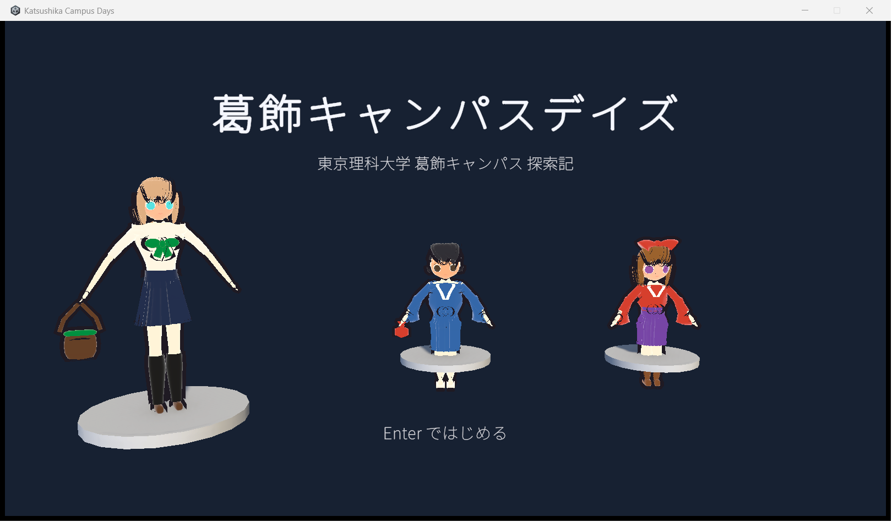

# Katsushika Campus Days（葛飾キャンパスデイズ）

東京理科大学 葛飾キャンパスを OpenStreetMap の実測フットプリントから 3D 再現し、
アニメ調の女の子（と公式マスコットのオマージュ）で歩き回る三人称探索アドベンチャー。
建物 9 棟は内部まで入れて、学生 NPC との会話でクエストが進み、1 日の終わりにリザルトが出る。



- エンジン: Unity 6 (6000.6.2f1, URP)
- アセット生成: Blender 4.5 LTS を headless Python で駆動（手作業ゼロで再生成できる）
- 音声: numpy で手続き合成した BGM 9 / SE 37 / 環境音 7（外部素材なし）
- 設計書: [docs/DESIGN.md](docs/DESIGN.md)、データ仕様: [docs/CONTENT_SPEC.md](docs/CONTENT_SPEC.md)
- 遊び方: [docs/HOW_TO_PLAY.md](docs/HOW_TO_PLAY.md)
- 複数のエージェントで分担するときの決まり: [docs/AGENT_COORDINATION.md](docs/AGENT_COORDINATION.md)

## 遊ぶ（ブラウザ版）

https://takumayellow.github.io/katsushika-campus-days/ を開く。Chrome / Edge / Firefox の最新版、
WebGL 2 対応 GPU。初回は約 100 MB を読み込む。セーブはブラウザに 1 枠（PlayerPrefs = IndexedDB）。

## 遊ぶ（配布版）

`dist/KatsushikaCampusDays_win64.zip` を展開して `KatsushikaCampusDays.exe` を起動する。
Windows 10/11 64bit、インストール不要。操作は WASD / 矢印キー移動、マウス視点、Shift ダッシュ、Space ジャンプ、
E で話す/入る、Tab クエストログ、Esc メニュー。詳細は [docs/HOW_TO_PLAY.md](docs/HOW_TO_PLAY.md)。

## 自分でビルドする

必要なもの: Unity 6000.6.2f1（Hub 版、URP テンプレート）、Blender 4.5、Python 3.11 以上（numpy）。

```bash
# 1. 地図 → キャンパス外構 FBX（Blender）。raw_overpass.json は Overpass API の `out geom;` 出力
python tools/osm_extract.py
"/c/Program Files/Blender Foundation/Blender 4.5/blender.exe" -b --python blender/build_campus.py
"/c/Program Files/Blender Foundation/Blender 4.5/blender.exe" -b --python blender/build_characters.py
"/c/Program Files/Blender Foundation/Blender 4.5/blender.exe" -b --python blender/build_interiors.py
"/c/Program Files/Blender Foundation/Blender 4.5/blender.exe" -b --python tools/render_minimap.py

# 2. 音声（約 6 分）
python tools/audio/build_audio.py

# 3. Unity: 取り込み → シーン生成 → Windows ビルド（unity/README.md に詳細）
export UNITY='/c/Program Files/Unity/Hub/Editor/6000.6.2f1/Editor/Unity.exe'
export KCD="$(pwd -W)"
MSYS_NO_PATHCONV=1 "$UNITY" -batchmode -nographics -quit -projectPath "$KCD\unity\KatsushikaCampusDays" -logFile "$KCD\unity\logs\import.log"
MSYS_NO_PATHCONV=1 "$UNITY" -batchmode -nographics -quit -projectPath "$KCD\unity\KatsushikaCampusDays" -executeMethod KCD.Editor.SceneBuilder.BuildAll -logFile "$KCD\unity\logs\scene.log"
MSYS_NO_PATHCONV=1 "$UNITY" -batchmode -nographics -quit -projectPath "$KCD\unity\KatsushikaCampusDays" -executeMethod KCD.Editor.BuildPlayer.BuildWindows -logFile "$KCD\unity\logs\build.log"
python tools/check_unity_log.py unity/logs/import.log unity/logs/scene.log unity/logs/build.log

# 4. テストとスモーク
MSYS_NO_PATHCONV=1 "$UNITY" -batchmode -nographics -projectPath "$KCD\unity\KatsushikaCampusDays" -runTests -testPlatform EditMode -testResults "$KCD\unity\logs\tests_editmode.xml" -logFile "$KCD\unity\logs\tests.log"
powershell.exe -NoProfile -ExecutionPolicy Bypass -File tools/smoke_run.ps1 -WaitSec 25 -Out docs/screenshots/smoke_title.png

# 5. 配布 zip
python tools/package_zip.py

# 6. ブラウザ版を GitHub Pages に載せる（WebGL ビルド → Release web-latest → pages.yml）
python tools/deploy_pages.py --build
```

Unity のライセンスは Hub でサインインしてから batchmode を使う。Unity 公式の agent skills は
`skills-lock.json` で固定してあり、`npx skills experimental_install` で `.agents/skills/` に復元できる。

## パイプライン

```
data/osm/raw_overpass.json ─ tools/osm_extract.py ─▶ data/osm/campus.json
data/osm/raw_route.json    ─ tools/osm_route.py   ─▶ data/osm/route.json（寮への道。隠しエンド #41 用）
                                                        │
blender/build_campus.py     ◀───────────────────────────┘  ─▶ unity/.../Assets/Models/Campus/*.fbx
blender/build_characters.py                                  ─▶ unity/.../Assets/Models/Characters/<id>/
blender/build_interiors.py                                   ─▶ unity/.../Assets/Models/Interiors/*.fbx + *.json
tools/audio/build_audio.py                                   ─▶ unity/.../Assets/Audio/{BGM,SE,Ambient}/*.wav
Unity -batchmode -executeMethod KCD.Editor.SceneBuilder.BuildAll   ─▶ Scenes/{Title,Campus}.unity
Unity -batchmode -executeMethod KCD.Editor.BuildPlayer.BuildWindows ─▶ build/Windows/
```

原点と投影（敷地ポリゴン way 175463006 の重心、x = 東 m / z = 北 m）は `tools/osm_common.py` で共有していて、
`python tools/osm_common.py --selfcheck` で `data/osm/campus.json` と照合できる。
Overpass の生データ 2 つは大きいので gitignore。寮への道の分は `data/osm/route_query.ql` を投げれば取り直せる。

## フォルダ

| 場所 | 内容 |
| --- | --- |
| `blender/` | 外構・キャラ 7 体・建物内部 9 棟の生成スクリプト（`kcd_lib` / `kcd_chara` / `kcd_interior`） |
| `tools/` | OSM 抽出（キャンパス／寮への道）、ミニマップ描画、音声合成、Unity ログ検査、スモーク起動、zip 化 |
| `unity/KatsushikaCampusDays/` | Unity プロジェクト。`Assets/Scripts/Editor` がシーンを組み立て、`Runtime` がゲーム本体 |
| `unity/KatsushikaCampusDays/Assets/Data/` | クエスト・会話・収集物・ローカライズ・モブ・リザルトの JSON |
| `docs/` | 設計書、データ仕様、クレジット、プレビュー画像、スクリーンショット |

## クレジット

- 地図データ © OpenStreetMap contributors (ODbL)。詳細は [docs/CREDITS.md](docs/CREDITS.md)
- 「坊っちゃん」「マドンナちゃん」は東京理科大学の公式キャラクター。本作は非公式・非営利のファンメイドで、独自にモデリングしている。
- フォント: Noto Sans JP (SIL Open Font License 1.1)
